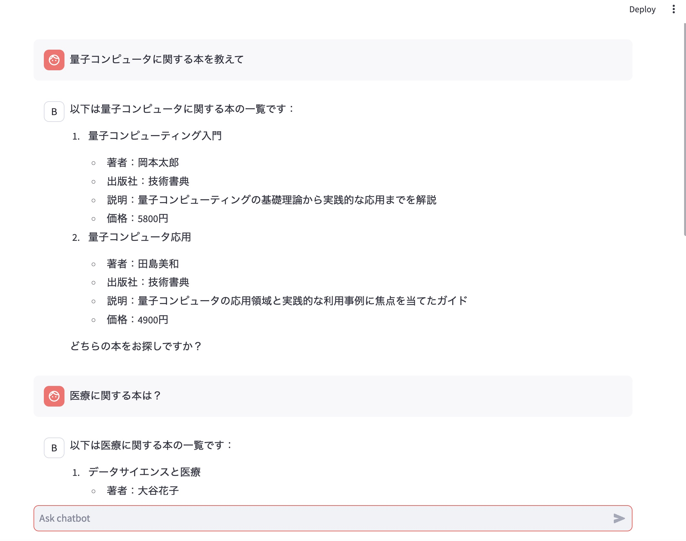
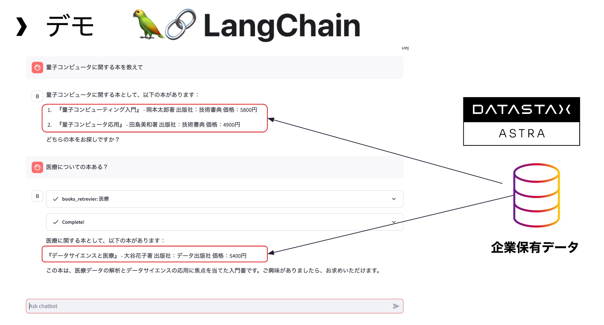
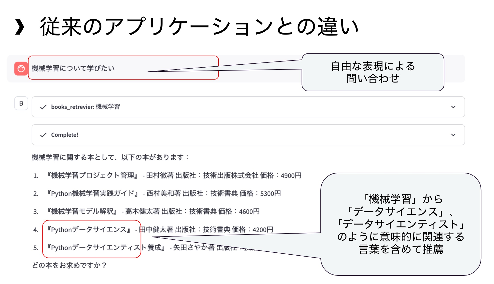

# Bookstore Clerk Chatbot

**NOTE: This web application is NOT designed for PRODUCTION use but demonstrating functions used there.**

## Technologies
- AstraDB Vector Search
- OpenAI
- LangChain
- Streamlit

## Data

[Notbook to load data for this chatbot](../langchain_astradb_openai_cassio.ipynb)

## Screen Shot

## Explanation of substantive (internal) differences

### Relationship with proprietary data

### Differences from traditional applications

 - Inquiries expressed in natural language such as "I want to learn about machine learning."
 - Recommendations based on seemantic similarity such as recommending books whose title is "data science" or "data scientist" based on the keyword “Machine Learning”
